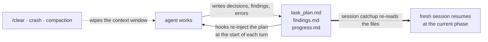

<div align="center">

</div>

<h1 align="center">Planning with Files</h1>

<p align="center">
  <strong>Your agent's context window dies. The plan does not.</strong>
</p>

<p align="center">
Persistent file-based planning for AI coding agents and long-running agent tasks: the skill keeps <code>task_plan.md</code>, <code>findings.md</code>, and <code>progress.md</code> on disk and re-injects them every turn, so the plan survives context loss, <code>/clear</code>, crashes, and compaction. Manus-style working memory on disk, with an opt-in completion gate. Installs across 60+ agents via the Agent Skills standard.
</p>

<p align="center">
  <a href="https://github.com/OthmanAdi/planning-with-files/stargazers"></a>
  <a href="https://github.com/OthmanAdi/planning-with-files/releases"></a>
  <a href="https://skillsplayground.com/skills/othmanadi-planning-with-files-planning-with-files/"></a>
  <a href="https://skill-history.com/othmanadi/planning-with-files"></a>
</p>

<p align="center">
  <a href="docs/evals.md"></a>
  <a href="docs/evals.md"></a>
  <a href="LICENSE"></a>
</p>

<p align="center">
  <a href="#before-and-after-clear">Before/After</a> ·
  <a href="#the-solution-3-file-pattern">The 3 Files</a> ·
  <a href="#quick-install">Install</a> ·
  <a href="#benchmark-results">Benchmarks</a> ·
  <a href="#works-across-18-platforms">Platforms</a> ·
  <a href="#faq">FAQ</a> ·
  <a href="docs/installation.md">Full install guide</a>
</p>

---

## Before and after /clear

Every coding agent loses its working memory when the context window resets. The plan does not have to die with it.

<table>
<tr>
<td width="50%" valign="top">

**Without planning files**

> **you:** continue
>
> **agent:** I don't have context from an earlier session. Can you describe the task and where you left off?

The agent re-reads the repo, asks you to restate the goal, and rediscovers work it already finished.

</td>
<td width="50%" valign="top">

**With planning-with-files**

```text
===BEGIN PLAN DATA===
# Task Plan: auth middleware refactor
### Phase 2: Patch token expiry check
- [x] Reproduce the bug
- [x] Fix expiry comparison
- **Status:** complete
### Phase 3: Regression tests
- [ ] Add expiry edge-case tests
- **Status:** in_progress
===END PLAN DATA===
```

> **agent:** Resuming Phase 3: adding the expiry edge-case tests.

</td>
</tr>
</table>

The transcript is illustrative; the `===BEGIN PLAN DATA===` block is the skill's real injection format, written into context by the `UserPromptSubmit` hook from `task_plan.md` on disk. In the project's internal recovery benchmark, a fresh session with the files on disk resumed in 5.0 turns on average against 13.3 for a raw agent (internal v1, author-run; method and limits in [docs/evals.md](docs/evals.md)).

```
┌──────────────────────────────────────────────┐
│  PLAN FILES                               3  │
│  AGENTS COVERED                         60+  │
│  PASS RATE (with skill)               96.7%  │
│  TEST SUITE                       301 green  │
│  SURVIVES /clear                        yes  │
└──────────────────────────────────────────────┘
```

## The Problem

Claude Code and most AI agents suffer from:

- **Volatile memory**: the TodoWrite list disappears on context reset
- **Goal drift**: after 50+ tool calls, the original goals get crowded out
- **Hidden errors**: failures are not tracked, so the same mistakes repeat
- **Context stuffing**: everything crammed into the window instead of stored

## The Solution: 3-File Pattern

For every complex task, create THREE files:

```
task_plan.md      → Track phases and progress
findings.md       → Store research and findings
progress.md       → Session log and test results
```

### The Core Principle

```
Context Window = RAM (volatile, limited)
Filesystem = Disk (persistent, unlimited)

→ Anything important gets written to disk.
```

In your project, exactly this lands on disk and nothing else:

```
your-project/
├── task_plan.md   ← phases + checkboxes; the resume point after /clear
├── findings.md    ← research notes and decisions, appended as you go
└── progress.md    ← session log and test results
```

Parallel tasks get isolated directories instead: `.planning/YYYY-MM-DD-slug/` with the same three files, selected via `.active_plan` (v2.36.0+). Plain markdown, gitignored by default, no runtime state anywhere else.

## How It Works

The agent stops at the first rung that applies:

```
1. Task needs 3+ steps or 5+ tool calls?  → create the three files first
2. Learned something?                     → append it to findings.md
3. Did something?                         → log it in progress.md
4. Phase done?                            → check it off in task_plan.md
5. Context died (/clear, crash)?          → session catchup re-reads all three
6. Every phase complete?                  → only then does the Stop gate release (gated mode)
```

Hooks make steps 2 to 6 mechanical rather than optional: 5 lifecycle hooks on Claude Code, 7 on Codex, 8 on Pi re-inject the plan each turn, remind after writes, and check completion before stopping.



### Session Recovery

When your context fills up and you run `/clear`, the skill recovers the previous session automatically:

1. Checks the active IDE's session store for previous session data (`~/.claude/projects/` for Claude Code, `~/.codex/sessions/` for Codex)
2. Finds when the planning files were last updated
3. Extracts the conversation that happened after (potentially lost context)
4. Shows a catchup report so you can sync

**Pro tip:** disable auto-compact to maximize context before clearing:

```json
{ "autoCompact": false }
```

Maintainer depth (hook architecture, dispatcher layout, parity tooling) lives in [AGENTS.md](AGENTS.md) and [docs/](docs/).

## Quick Install

**Claude Code, plugin route** (ships everything: skill, hooks, slash commands):

```
/plugin marketplace add OthmanAdi/planning-with-files
/plugin install planning-with-files@planning-with-files
```

**Every other agent**, one line, 60+ agents via the [Agent Skills](https://agentskills.io) standard:

```bash
npx skills add OthmanAdi/planning-with-files --skill planning-with-files -g
```

Under a minute. Safe to re-run. Trigger it by typing `/plan` (plugin) or asking the agent to "plan this task"; the skill also self-triggers on multi-step tasks.

What each route actually ships:

| Route | Skill + scripts + templates | Slash commands | Hooks |
|---|---|---|---|
| Claude Code plugin | yes | **yes** | **yes** |
| `npx skills add` | yes | no | frontmatter hooks, see note |
| ClawHub / manual copy | yes | no | frontmatter hooks, see note |

Skill-route installs can end up silently hook-less (project trust not accepted, or frontmatter hooks not registering on project-level installs). The hooks are the differentiating mechanism, so if they matter to you, use the plugin route, then verify with `/plan-doctor`. Full matrix and the two silent killers: [docs/installation.md](docs/installation.md#what-each-install-route-actually-ships).

Install acting up? Open your agent and say: *"Read docs/installation.md and docs/troubleshooting.md from OthmanAdi/planning-with-files and fix my install."* Then run `/plan-doctor`.

<details>
<summary><strong>🌐 Available in 5 other languages</strong></summary>

**🇸🇦 العربية / Arabic**
```bash
npx skills add OthmanAdi/planning-with-files --skill planning-with-files-ar -g
```

**🇩🇪 Deutsch / German**
```bash
npx skills add OthmanAdi/planning-with-files --skill planning-with-files-de -g
```

**🇪🇸 Español / Spanish**
```bash
npx skills add OthmanAdi/planning-with-files --skill planning-with-files-es -g
```

**🇨🇳 中文版 / Chinese (Simplified)**
```bash
npx skills add OthmanAdi/planning-with-files --skill planning-with-files-zh -g
```

**🇹🇼 正體中文版 / Chinese (Traditional)**
```bash
npx skills add OthmanAdi/planning-with-files --skill planning-with-files-zht -g
```

</details>

<details>
<summary><strong>Prefer <code>/planning-with-files</code> with no prefix?</strong></summary>

Copy the skill to your local folder:

**macOS/Linux:**
```bash
cp -r ~/.claude/plugins/cache/planning-with-files/planning-with-files/*/skills/planning-with-files ~/.claude/skills/
```

**Windows (PowerShell):**
```powershell
Copy-Item -Recurse -Path "$env:USERPROFILE\.claude\plugins\cache\planning-with-files\planning-with-files\*\skills\planning-with-files" -Destination "$env:USERPROFILE\.claude\skills\"
```

</details>

All install methods: [docs/installation.md](docs/installation.md).

## Commands

Slash commands ship with the Claude Code plugin route (see the install matrix above).

| Command | Autocomplete | What you get |
|---------|--------------|--------------|
| `/planning-with-files:plan` | type `/plan` | Creates the three planning files and starts the session (v2.11.0+) |
| `/planning-with-files:pwf` | type `/pwf` | Short alias for `/plan`; `--autonomous` / `--gated` init (v3.0.0+) |
| `/planning-with-files:status` | type `/status` | One-glance report: current phase and phase totals (v2.15.0+) |
| `/planning-with-files:plan-doctor` | type `/plan-doctor` | Self-check for the failure modes that are silent by design: one PASS/WARN/FAIL line each for resolution, injection, attestation, install surfaces, and per-fire latency (v3.6.0+) |
| `/planning-with-files:plan-attest` | type `/plan-attest` | Locks `task_plan.md` with a SHA-256; hooks refuse a tampered plan body; `--show` / `--clear` (v2.37.0+) |
| `/planning-with-files:plan-goal` | type `/plan-goal` | Runs until the plan reports complete, composing with Claude Code `/goal` (v2.38.0+) |
| `/planning-with-files:plan-loop` | type `/plan-loop` | Planning-aware cadence on `/loop`, default 10 minute tick (v2.38.0+) |
| `/planning-with-files:plan-de` | type `/plan-de` | Start planning in German; also `-ar`, `-es`, `-zh`, `-zht` (v2.33.0+) |
| `/planning-with-files:start` | type `/planning` | Original start command |

Typing `/plan` prefix-matches every `plan*` command in autocomplete; `/planning-with-files:status` autocompletes as `/status` (the older `/plan:status` label predates the rename).

### Pi extension commands

Install the Pi extension with `pi install npm:@tomxprime/planning-with-files`; it registers these commands, typed with no `/planning-with-files:` prefix.

| Command | What it does | Version |
|---------|--------------|---------|
| `/plan-execute` | Pi only. Approve the active plan to ACTIVATE all Pi hooks; hooks stay passive until you run this; `reset` returns to passive review | v3.3.0+ |
| `/plan-status` | Active plan path, scope, and phase totals | v2.39.0+ |
| `/plan-goal <text\|default\|clear>` | Set or clear the goal string appended to auto-continue prompts | v2.39.0+ |
| `/plan-loop [interval] [prompt\|stop]` | Start or stop a planning tick (default 10m) that re-reads the plan and nudges progress | v2.39.0+ |
| `/plan-attest [--show\|--clear]` | Run the attest-plan helper; shares the `.attestation` file with Claude Code | v2.39.0+ |

On Pi there is no `/plan` command to create the files; the skill creates them, then `/plan-execute` approves and activates the hooks. Pi `plan-goal`/`plan-loop` run their own logic, while the Claude Code commands of the same name forward to native `/goal` and `/loop`. The doctor ships as a script in every mirror since v3.7.0: run `sh scripts/plan-doctor.sh` directly on platforms without the command.

### Command names vs skill names

| Platform | You type | Examples |
|----------|----------|----------|
| Claude Code | `/planning-with-files:<verb>`, autocompletes from the short form | `/plan`, `/pwf`, `/plan-attest`, `/plan-de` |
| Pi | bare form, no prefix | `/plan-status`, `/plan-execute`, `/plan-goal` |
| Continue.dev | `/planning-with-files` | |

The model-invocable SKILLS are named `planning-with-files:planning-with-files` (and `-ar`, `-de`, `-es`, `-zh`, `-zht`); the doubled form is the skill id, not a command you type. There is no `/pwf-de` and no `/planning-with-files:planning-with-files-goal`; `/pwf` is just a short alias for `/plan`.

## Works across 18+ platforms

One skill, three integration tiers. Know what your agent gets before you install:

| Tier | Platforms | What you get |
|------|-----------|--------------|
| **Enhanced** (hooks + lifecycle automation) | Claude Code, Cursor, GitHub Copilot, Mastra Code, Gemini CLI, Kiro, Codex, Hermes, CodeBuddy, Factory Droid, OpenCode | Plan injection every turn, progress reminders, completion check |
| **Standard Agent Skills** | Continue, Pi, OpenClaw, Autohand Code, Antigravity, Kilocode, AdaL CLI | SKILL.md discovery via `npx skills add`; the pattern without lifecycle hooks |
| **Agent Skills standard path** (in-tree since v3.7.0) | Zed, Amp, Warp, Devin, Antigravity, Gemini CLI, Cursor | `.agents/skills/planning-with-files/` discovered from a plain `git clone`, no per-tool setup |

<details>
<summary><strong>Enhanced Support: per-IDE setup guides</strong></summary>

| IDE | Installation Guide | Integration |
|-----|-------------------|-------------|
| Claude Code | [Installation](docs/installation.md) | Plugin + SKILL.md + Hooks |
| Cursor | [Cursor Setup](docs/cursor.md) | Skills + [hooks.json](https://cursor.com/docs/hooks) |
| GitHub Copilot | [Copilot Setup](docs/copilot.md) | [Hooks](https://docs.github.com/en/copilot/reference/hooks-configuration) (incl. errorOccurred) |
| Mastra Code | [Mastra Setup](docs/mastra.md) | Skills + [Hooks](https://mastra.ai/docs/mastra-code/configuration) |
| Gemini CLI | [Gemini Setup](docs/gemini.md) | Skills + [Hooks](https://geminicli.com/docs/hooks/) |
| Kiro | [Kiro Setup](docs/kiro.md) | [Agent Skills](https://kiro.dev/docs/skills/) |
| Codex | [Codex Setup](docs/codex.md) | [Skills + Hooks](https://developers.openai.com/codex/skills) |
| Hermes Agent | [Hermes Setup](docs/hermes.md) | Skill + Project Plugin |
| CodeBuddy | [CodeBuddy Setup](docs/codebuddy.md) | [Skills + Hooks](https://www.codebuddy.ai/docs/cli/skills) |
| FactoryAI Droid | [Factory Setup](docs/factory.md) | [Skills + Hooks](https://docs.factory.ai/cli/configuration/skills) |
| OpenCode | [OpenCode Setup](docs/opencode.md) | Skills + Custom session storage |

</details>

<details>
<summary><strong>Standard Agent Skills: discovery paths</strong></summary>

| IDE | Installation Guide | Skill Discovery Path |
|-----|-------------------|---------------------|
| Continue | [Continue Setup](docs/continue.md) | `.continue/skills/` + [.prompt files](https://docs.continue.dev/customize/deep-dives/prompts) |
| Pi Agent | [Pi Agent Setup](docs/pi-agent.md) | `.pi/skills/` ([npm package](https://www.npmjs.com/package/@mariozechner/pi-coding-agent)) |
| OpenClaw | [OpenClaw Setup](docs/openclaw.md) | `.openclaw/skills/` ([docs](https://docs.openclaw.ai/tools/skills)) |
| Autohand Code | [Autohand Code Setup](docs/autohand.md) | `~/.autohand/skills/` or `.autohand/skills/` |
| Antigravity | [Antigravity Setup](docs/antigravity.md) | `.agent/skills/` ([docs](https://codelabs.developers.google.com/getting-started-with-antigravity-skills)) |
| Kilocode | [Kilocode Setup](docs/kilocode.md) | `.kilocode/skills/` ([docs](https://kilo.ai/docs/agent-behavior/skills)) |
| AdaL CLI (Sylph AI) | [AdaL Setup](docs/adal.md) | `.adal/skills/` ([docs](https://docs.sylph.ai/features/plugins-and-skills)) |

> **Note:** If your IDE uses the legacy Rules system instead of Skills, see the [`legacy-rules-support`](https://github.com/OthmanAdi/planning-with-files/tree/legacy-rules-support) branch.

</details>

<details>
<summary><strong>Sandbox runtimes</strong></summary>

| Runtime | Status | Guide | Notes |
|---------|--------|-------|-------|
| BoxLite | ✅ Documented | [BoxLite Setup](docs/boxlite.md) | Run Claude Code + planning-with-files inside hardware-isolated micro-VMs |

> BoxLite is a sandbox runtime, not an IDE. Skills load via [ClaudeBox](https://github.com/boxlite-ai/claudebox), BoxLite's official Claude Code integration layer.

</details>

## Why This Skill?

On December 29, 2025, [Meta acquired Manus for $2 billion](https://techcrunch.com/2025/12/29/meta-just-bought-manus-an-ai-startup-everyone-has-been-talking-about/). In just 8 months, Manus went from launch to $100M+ revenue. Their secret? **Context engineering.**

> "Markdown is my 'working memory' on disk. Since I process information iteratively and my active context has limits, Markdown files serve as scratch pads for notes, checkpoints for progress, building blocks for final deliverables."
> — Manus AI

This skill packages that exact pattern for your coding agent.

### The Manus Principles

| Principle | Implementation |
|-----------|----------------|
| Filesystem as memory | Store in files, not context |
| Attention manipulation | Re-read plan before decisions (hooks) |
| Error persistence | Log failures in plan file |
| Goal tracking | Checkboxes show progress |
| Completion verification | Stop hook checks all phases |

## Benchmark Results

> **Methodology note:** the 96.7% figure comes from the v2.21.0 evaluation run on `claude-sonnet-4-6` (2026-03-06). It measures file-pattern fidelity (does the agent create and maintain the 3-file structure), not goal-drift over long autonomous runs. Newer models and the autonomous-mode work are not yet covered by this number. Full methodology, dataset, and assertion list: [docs/evals.md](docs/evals.md).

Evaluated with Anthropic's [skill-creator](https://github.com/anthropics/skills/tree/main/skills/skill-creator) framework: skill v2.21.0, model `claude-sonnet-4-6`, 2026-03-06. 10 parallel subagents, 5 task types, 30 objectively verifiable assertions, 3 blind A/B comparisons.

<p align="center">
  
</p>

| Test | with_skill | without_skill |
|------|-----------|---------------|
| Pass rate (30 assertions) | **96.7%** (29/30) | 6.7% (2/30) |
| 3-file pattern followed | 5/5 evals | 0/5 evals |
| Blind A/B wins | **3/3 (100%)** | 0/3 |
| Avg rubric score | **10.0/10** | 6.8/10 |

### Recovery after a context wipe

> **Internal benchmark, v1 (2026-07-06).** Author-run against v3.4.0, harness-authored tasks, deterministic grading, no LLM grades anything. Treat it as the project's own measurement, not an independent comparison. Full method, arms, disclosed limits, and grader validation: [docs/evals.md](docs/evals.md#test-5-competitive-benchmark-v1-seven-planning-methods-head-to-head-2026-07-06-internal).

Protocol: the session is hard-stopped at roughly half done, and a fresh session is told only "Continue the work in this directory." Every graded run across every arm ended pytest-green (77/77), so the difference is re-orientation cost, not correctness.

<p align="center">
  
</p>

**With the planning files on disk, a resume took 5.0 turns on average; a raw agent took 13.3.** Session catchup plus hook injection put phase state in front of the model before its first tool call, and the same run found no correctness penalty anywhere. An animated summary lives at [docs/benchmark/index.html](docs/benchmark/index.html) ([rendered view](https://htmlpreview.github.io/?https://github.com/OthmanAdi/planning-with-files/blob/master/docs/benchmark/index.html)).

[Full methodology and results](docs/evals.md) · [Technical write-up](docs/article.md)

## v3 Long-Running Agent Features

The v3 line adds features aimed at long-running agentic runs. Each one is listed with the command or flag that turns it on. With no mode marker set, the hooks produce the same output as v2.43, so nothing changes for existing setups.

- **Autonomous mode** (`/pwf --autonomous`, or `init-session.sh --autonomous`): drops the per-tool-call plan recitation, keeps the turn-start injection, and turns attestation on by default.
- **Gated mode** (`--gated`): adds a Stop completion gate that blocks only when all completion conditions hold at once, so an incomplete plan alone never traps a session.
- **Auto-continue on Pi** (`agent_end` handler): re-prompts the agent up to a limit of 3 to keep an unfinished plan moving, plus an optional `/plan-goal` string appended to the prompt.
- **Pi approval gate** (`/plan-execute`): Pi hooks stay passive with a status line until you approve the active plan for the current session.
- **Session-catchup**: resumes work after `/clear` by re-reading the planning files from the active IDE's session store.
- **PreCompact progress flush** (`PreCompact` hook): surfaces a reminder to flush progress before compaction completes, and prints the active Plan-SHA256 when attested.
- **SHA-256 plan attestation** (`/plan-attest`): locks `task_plan.md`; a tampered plan body is refused at injection.
- **Run ledger**: an append-only JSONL record of phase transitions that replaces the raw `progress.md` tail in v3 modes with a fixed-shape summary.
- **Host capability tiers**: hard block on Claude Code, Codex, and Continue; follow-up injection on Cursor, Pi, and Kiro; notify-only elsewhere.
- **Per-invocation opt-out** (`PLANNING_DISABLED=1`, v3.4.0): a one-shot session that merely shares a cwd with an incomplete plan skips all plan reading at every hook entry point.

### Hooks and modes reference

| Platform | Lifecycle hooks | Where registered |
|----------|-----------------|------------------|
| Claude Code | 5: UserPromptSubmit, PreToolUse, PostToolUse, Stop, PreCompact | The skill's `SKILL.md` frontmatter (not `plugin.json`), so they ship with the bundled skill |
| Codex CLI | 7: SessionStart, UserPromptSubmit, PreToolUse, PermissionRequest, PostToolUse, PreCompact, Stop | `.codex/hooks.json`, Windows-safe via `commandWindows` since v3.4.1 |
| Pi | 8 lifecycle handlers in the bundled extension | The injection and recitation handlers stay passive until `/plan-execute` |

Pi runtime modes:

| Pi mode | Behavior |
|---------|----------|
| `auto` | Detects the model and picks `parity` or `cache-safe` |
| `parity` | Full plan injection, mirrors the Claude Code skill |
| `cache-safe` | A stable reminder instead of full injection, for KV-cache-sensitive models like DeepSeek |
| `notify` | Status-line only, no model injection |

## Key Rules

1. **Create Plan First** — Never start without `task_plan.md`
2. **The 2-Action Rule** — Save findings after every 2 view/browser operations
3. **Log ALL Errors** — They help avoid repetition
4. **Never Repeat Failures** — Track attempts, mutate approach

## When to Use

**Use this pattern for:**
- Multi-step tasks (3+ steps)
- Research tasks
- Building/creating projects
- Tasks spanning many tool calls
- Long-running agent sessions that must survive `/clear` and compaction

## File Structure

What the skill writes into your project is three markdown files (see [the 3-file pattern](#the-solution-3-file-pattern)). What the repository ships:

<details>
<summary><strong>Repository layout</strong></summary>

```
planning-with-files/
├── skills/planning-with-files/   # canonical skill: SKILL.md, scripts/, templates/, reference.md, examples.md
│   └── ...-ar / -de / -es / -zh / -zht    # 5 translated variants
├── .agents/skills/planning-with-files/   # Agent Skills standard path, full surface (v3.7.0+)
├── commands/                     # 13 slash commands (plugin route only)
├── scripts/ · templates/        # root-level copies for CLAUDE_PLUGIN_ROOT
├── .claude-plugin/               # plugin + marketplace manifests
├── .codex/ .cursor/ .github/ .gemini/ .kiro/ .continue/ .pi/
├── .codebuddy/ .factory/ .hermes/ .mastracode/ .opencode/   # per-IDE mirrors, parity-locked
├── docs/                         # 25+ guides incl. per-platform setup, evals.md, benchmark/
├── tests/                        # 217-test suite (pytest), green on Windows and Linux CI
├── CHANGELOG.md · MIGRATION.md · SECURITY.md · CONTRIBUTING.md · CONTRIBUTORS.md
├── CITATION.cff · llms.txt · LICENSE
└── README.md
```

Every release bumps 18 parity-locked copies via `scripts/bump-version.py`; a test fails if any variant lags.

</details>

## FAQ

### How do I stop my coding agent from losing its plan after /clear or a crash?

The plan lives on disk in `task_plan.md`, `findings.md`, and `progress.md`, not only in the context window. At the start of each turn the `UserPromptSubmit` hook re-injects the active plan, and after a `/clear` or a new session the skill re-reads the files from disk (session recovery), so the agent recovers its goals and progress automatically.

### What is the difference between planning-with-files and an agent memory tool?

Agent memory tools (vector stores, knowledge graphs) help an agent recall facts from past sessions. planning-with-files manages active execution state: the phases, status, dependencies, and completion check for the task the agent is working on right now. The problem it solves is planning continuity, not retrieval, and the two are complementary.

### How does this prevent context rot?

Context rot is the drift that sets in as the context window fills and earlier instructions get crowded out. Because the plan is re-injected at the start of each turn from disk, the goals and phase status stay in the model's attention window as the conversation grows. This is an implementation of what Anthropic calls structured note-taking: write durable state to files outside the window, then read it back in when needed.

### Which coding agents does this work with?

Claude Code, OpenAI Codex CLI, Cursor, GitHub Copilot, Kiro, OpenCode, Continue, Pi, CodeBuddy, Factory, Mastra, and 70+ others via the SKILL.md open standard (the `npx skills` installer alone targets 71 agents). Since v3.7.0 the repo also ships the cross-tool `.agents/skills/planning-with-files/` layout in-tree, so tools that read the Agent Skills standard path natively (Zed, Amp, Warp, Devin, Antigravity, Gemini CLI, Cursor) discover the current skill from a plain `git clone` with no per-tool setup. Installation is one command; see [Quick Install](#quick-install) above.

### How does this work with Claude Code's plan mode?

They are complementary stages, not alternatives. Plan mode is where you design and approve the approach before execution. planning-with-files persists the live execution state (phase status, findings, errors, progress) on disk while the work runs and re-injects it every turn. The handoff is one step: after accepting a plan-mode plan, tell the agent to write it into `task_plan.md` as phases (or invoke `/plan` and let the skill create the files from it), then execute in normal mode. From that point the hooks keep the phases in the attention window, and the files survive `/clear`, compaction, and session death.

### What happens to the plan files after a task is complete?

They are working memory, not a tracked deliverable. `task_plan.md`, `findings.md`, `progress.md`, and the `.planning/` directory are gitignored by default and are not archived automatically: the next task overwrites the root plan, and a slug directory just stops being active. Anything worth keeping should be promoted into code, a commit, or a doc. See [After Completion: What Happens to the Plan Files](docs/workflow.md#after-completion-what-happens-to-the-plan-files) for the full lifecycle and how to retain a completed plan. This is a deliberate default, not a missing feature; a completion-triggered archive step is a welcome opt-in extension.

### How fast are the hooks?

One hook fire measures 289ms wall-clock since the v3.6.0 optimization, down from 2.0 to 2.4 seconds before it, and the injected plan block is KV-cache stable by construction. The plan stays in the attention window every turn, and `/clear` stops being fatal.

<details>
<summary><strong>📦 Releases</strong></summary>

| Version | Highlights |
|---------|------------|
| **v3.8.0** | **The Stop hook never fired on macOS or Linux** (a dead install-path fallback stacked on PowerShell-first dispatch), and **session recovery searched a project directory that does not exist** for POSIX or underscore project paths; both fixed with tests that execute the hooks end to end. Opt-in structure-aware injection (`PWF_INJECT=smart`) keeps the active phase and decision journal in the window late in long plans. Next Step pointer in the templates, tool-result outcomes in session catchup, macOS CI leg plus a BSD-userland simulation harness, `resolve-plan-dir.ps1` parity with fail-closed containment, UTF-8-safe ledger truncation, pinned line endings, and a rebuilt README with honest benchmark charts. Suite at 301. |
| **v3.7.0** | **Agent Skills standard layout ships in-tree**: `.agents/skills/planning-with-files/` carries the full canonical surface, so tools that read the standard path natively (Zed, Amp, Warp, Devin, Antigravity, Gemini CLI, Cursor) discover the current skill from a plain `git clone`. Locked into the 18-entry parity set; `plan-doctor.sh` now ships in every synced IDE folder. |
| **v3.6.0** | **Windows-native coreutils silently killed plan resolution and every hook injection** (backslash `realpath` broke the containment match); fixed, with per-fire latency down to 289ms on the machine that measured 2.0-2.4s at v3.4.0. New `/plan-doctor` self-check, install-route matrix in the docs, suite green at 217. |
| **v3.5.1** | Codex Windows shell resolver skips WSL bash launchers, `pwf-hook.cmd` hardens Python discovery, and Pi recitations are delivered as `nextTurn` so interactive tools are not broken. |
| **v3.5.0** | **Codex Windows hooks emit valid JSON and survive Unicode** (PR #205 by @yolo0731, closes #204); the Pi extension stops re-nagging closed and complete plans (#203 by @ziyu4huang); the plan lifecycle is documented (#202 by @kcinzgg). Four broken language-command references fixed, `/plan-zht` added. |
| **v3.4.1** | **Codex hooks now run on Windows** (closes #201, reported by @mahdiit): per-hook `commandWindows` overrides, a `pwf-hook.cmd` launcher that never resolves the Store `python3` alias, and a Git Bash resolver anchored on `git.exe`. |
| **v3.4.0** | **`PLANNING_DISABLED=1` per-invocation opt-out** so one-shot sessions that merely share a cwd with an incomplete plan are not hijacked (closes #195, reported by @marcmuon). Ships in every distributed copy. |
| **v3.3.0** | **Pi hooks wait for explicit approval via `/plan-execute`** before activating (PR #193 by @Dikshj, closes #190, requested by @lazyst). A plan with a tampered attestation cannot be approved. |
| **v3.2.0** | **Repository health audit**: `session-catchup.py` (the resume-after-`/clear` mechanism) was non-functional on Windows and `inject-plan.sh` silently dropped injection under aliased paths; both fixed, plus the "0/0 phases" false status (closes #191, #188, addresses #103). `SECURITY.md` added. (thanks @Stephen-abc, @igorcosta, @mixian939, @AvitalAviv) |
| **v3.1.3** | **Hotfix**: v3.1.2's unquoted SKILL.md description broke the YAML frontmatter; quoted everywhere plus a new frontmatter-validity test. |
| **v3.1.2** | Session-catchup works outside the plugin runtime via a `$HOME` fallback (PR #186 by @shunfeng8421, closes #185, reported by @xwang118), `.hermes` parity, refreshed skill descriptions. |
| **v3.1.1** | Codex verification command matches the current `hooks` feature key (PR #184 by @Fat-Jan). |
| **v3.1.0** | Codex Stop hook no longer blocks on an incomplete plan, native Codex PreCompact parity, Pi extension test suite, SHA-cache docs (PR #180 by @2023Anita closes #178, PR #181 by @GongYuanCaiJi, PRs #174/#175 by @mvanhorn close #163, #164). |
| **v3.0.0** | **Autonomous and gated modes for long-running runs**: append-only JSONL run ledger, opt-in completion gate, attestation default-on in v3 modes, `MIGRATION.md`. No breaking changes: with no mode marker the hooks produce byte-identical v2.43 output. |
| **v2.43.0** | **CONTRIBUTING.md + OpenCode docs fix + `.continue`/`.gemini`/`.kiro` variant sync to parity** (PR #171 by @Skulli485, issue #172 by @luyanfeng, issues #159/#160/#161): first `CONTRIBUTING.md` at repo root, auto-surfaced by GitHub in the PR creation flow. `docs/opencode.md` Quick Install switched from \`git clone\` to \`npx skills add\` after the manual-install block was found referencing a doubled path (`planning-with-files/planning-with-files/SKILL.md`). Three historically lagging IDE SKILL.md variants brought to v2.43.0 parity: `.continue` from v2.34.0 (9 versions behind), `.gemini` from v2.34.0 (9 versions behind), `.kiro` from v2.32.0-kiro (11 versions behind), preserving IDE-specific frontmatter, hook shapes, and Kiro Agent Skill layout. |
| **v2.42.0** | **POSIX `init-session.sh` portability + plugin-vs-skill install transparency + Topic Handoff docs** (PR #169 and PR #170 by @carterusedulm2-maker): `init-session.sh` and its 7 mirrors swap the `[[ ]]` bashism for POSIX `[ ]` so `tests/test_init_session_slug.py` runs cleanly under `dash` (Ubuntu) when the test invokes the script via `sh` rather than the `bash` shebang. Canonical SKILL.md gains an install-scope clarification: `/plugin install` ships the `commands/` folder with `/plan-goal` and `/plan-loop`, but `npx skills add` (and ClawHub) do not. A manual fallback procedure for both wrappers is documented inline so skill-only sessions can produce the same effect by invoking Claude Code's native `/goal` and `/loop` primitives directly. `docs/quickstart.md` and `docs/workflow.md` add an optional Topic Handoff Pattern for very long-running operational topics (`handoffs/<topic>.md` alongside `progress.md`). |
| **v2.41.0** | **Windows exec-bit test skip + attestation-locking docs** (PR #167 by @gauravvojha, Issue #166; PR #168 by @CleanDev-Fix, Issue #165): `test_script_permissions.py` now skips on Windows with a class-level `pytest.mark.skipif(sys.platform == "win32")` since NTFS does not store POSIX executable bits; the 2 pre-existing Windows exec-bit failures (present since v2.34.1) are resolved. New dedicated `docs/attestation-locking.md` page documents the `attest-plan.sh` write path, the atomic temp-rename guarantee, the optional `flock` advisory lock, and the recommended slug-mode workflow for parallel sessions. |
| **v2.40.1** | **Pi adapter SKILL.md sync gap + npm scope correction** (PR #158 by @TomXPRIME): the `.pi` SKILL.md lagged the canonical Claude Code copy after v2.39.0; v2.40.1 backports Rule 7 (Continue After Completion), the Security Boundary section, the expanded Scripts section covering `set-active-plan.sh`/`resolve-plan-dir.sh`/`attest-plan.sh` plus the parallel task workflow, and the "Write web content to task_plan.md" anti-pattern row. The Pi npm package is renamed from the unscoped `pi-planning-with-files` to `@tomxprime/planning-with-files`, matching the package author's namespace; install docs updated accordingly. Author, repository, license, and bugs URLs preserved. |
| **v2.40.0** | **Slug-mode resolution fixes + perf cache + KV-cache hygiene + Pi false-positive fix** (9 items from the v2.40 R&D experiment): hook resolution order inverted so slug-mode wins over legacy root, `.active_plan` target dir + content validated against a safe-identifier regex, `check-complete.sh` honors `$PLAN_ID` and `.active_plan`, Pi extension `isDangerousBashCommand` swapped to a word-boundary regex array so benign `git push origin <branch>` no longer fires the warning, mtime-keyed SHA-256 cache cuts attestation-hook latency on Windows Git Bash, `progress.md` tail timestamps normalized for KV-cache prefix stability, `resolve-plan-dir.sh` mtime resolution made portable across GNU/BSD/macOS/Alpine/Git Bash with python+perl fallbacks, `attest-plan.sh` uses atomic temp-rename with optional `flock` to close the concurrent-writer race. 130 pass / 2 pre-existing Windows exec-bit fails, +20 new tests. |
| **v2.39.0** | **Pi Coding Agent full hook parity extension + Codex hooks flag fix** (PR #157 by @TomXPRIME, Issue #154 by @DLI1996): the `.pi` adapter ships a bundled TypeScript extension mapping eight Pi lifecycle events to the same behavior the skill provides on Claude Code, with a four-mode system (`auto`/`parity`/`cache-safe`/`notify`) that auto-detects DeepSeek and keeps the KV-cache prefix stable. Pi runtime reads the same `.attestation` file the canonical v2.37 `attest-plan.sh` writes, so attesting once locks the plan across both runtimes. Four slash commands (`/plan-status`, `/plan-attest`, `/plan-goal`, `/plan-loop`) mirror their Claude Code counterparts. Separately, `docs/codex.md` swaps from `codex_hooks = true` to `hooks = true` to match the current OpenAI canonical key, with an alias note so users on older configs are not pushed to migrate. |
| **v2.38.1** | **Description field garbled in Claude Code skill picker** (surfaced via Discussion #153 by @bmyury): hook commands embedded `'---BEGIN PLAN DATA---'` plan-injection delimiters; Claude Code's skill-discovery loader split frontmatter on the first `---` and read the truncated value as the description. Swapped to `===BEGIN PLAN DATA===` / `===END PLAN DATA===` across canonical SKILL.md, all five language variants, the `.codebuddy/.codex/.cursor` adapter mirrors, and `clawhub-upload`. Hook execution and tamper attestation never affected; only the displayed metadata. |
| **v2.38.0** | **Claude Code turn-loop integration + OpenCode SQLite fix**: new PreCompact hook fires on `/compact` and autoCompact, surfaces a reminder to flush progress before compaction completes and prints the active Plan-SHA256 when attested. New `/plan-goal` slash command composes with Claude Code's `/goal` (v2.1.139, May 12 2026): derives a termination condition from the active plan. New `/plan-loop` composes with `/loop` (v2.1.72+): default 10-minute tick re-reads planning files and runs check-complete. New `templates/loop.md` for the bare `/loop` planning-aware default. Session-catchup rewritten for OpenCode's SQLite migration. Codex gets a `PermissionRequest` adapter that surfaces plan context at permission prompts. |
| **v2.37.0** | **Hash attestation + parity bumper** (closes #150, #151): `/plan-attest` locks `task_plan.md` with a SHA-256; hooks block injection on tamper. `scripts/bump-version.py` + parity test kill the "missed one variant" regression class behind v2.34.1, v2.36.0, v2.36.2, and v2.36.3. (thanks @oaabahussain!) |
| **v2.36.3** | **Parallel planning scripts now ship in the skill**: `resolve-plan-dir.sh` and `set-active-plan.sh` were missing from the installed skill in v2.36.0; now in canonical + all IDE mirrors + SKILL.md docs updated |
| **v2.36.2** | **Canonical script sync** (PR #149): `skills/planning-with-files/scripts/init-session.sh` was missing slug mode from v2.36.0; now synced with IDE mirrors + regression test. (thanks @voidborne-d!) |
| **v2.36.1** | **Security hardening**: Stop hook cache search removed, ExecutionPolicy Bypass changed to RemoteSigned, prompt injection delimiters added. (Gen Agent Trust Hub FAIL resolved) |
| **v2.36.0** | **Parallel plan isolation + Codex session isolation** (closes #146, #148): `init-session.sh` slug mode, `set-active-plan.sh`, `resolve-plan-dir.sh`, all Codex hooks route through resolver, session attachment gating. **Hermes docs** (closes #147): integration notes added to `docs/hermes.md`. 34 new tests. (thanks @githubYiheng, @09ashishkapoor, @shawnli1874!) |
| **v2.35.1** | **Shebang portability fix**: changed `/bin/bash` to `/usr/bin/env bash` in hook scripts, fixing compatibility on NixOS and other systems where bash is not at `/bin/bash`. (thanks @Emin017!) |
| **v2.35.0** | **Hermes adapter + NLPM audit hardening**: Hermes platform 17 support (thanks @bailob!), NLPM audit fixed Python PATH resolution, session-catchup injection cap, Pi PowerShell syntax (thanks @xiaolai!) |
| **v2.34.1** | **Stop hook Windows portability fix** (closes #133): `export SD=` failed in Windows Git Bash hook context; fallback path was wrong for plugin cache structure. Fixed across all 13 SKILL.md variants. (thanks @nazeshinjite!) |
| **v2.34.0** | **Codex hooks fully restored** (closes #132): `.codex/hooks.json` + lifecycle scripts back — SessionStart, UserPromptSubmit, PreToolUse, PostToolUse, Stop. Tessl CI for SKILL.md quality reviews. Exec bit fix. 4 missing contributors added. (thanks @Leon-Algo, @popey!) |
| **v2.33.0** | **Multi-language expansion**: Arabic, German, and Spanish skill variants added (thanks to community contributors!) |
| **v2.32.0** | Codex session catchup rewrite (thanks @ebrevdo!), Loaditout A-grade security badge, Stop hook Git Bash fix |
| **v2.31.0** | Codex hooks.json integration with full lifecycle hooks (thanks @Leon-Algo!) |
| **v2.30.1** | Fix: Codex script executable bits restored (thanks @Leon-Algo!) |
| **v2.30.0** | `CLAUDE_SKILL_DIR` variable, IDE configs moved to per-IDE branches, plugin.json bumped from 2.23.0 |
| **v2.29.0** | Analytics workflow template: `--template analytics` flag for data exploration sessions (thanks @mvanhorn!) |
| **v2.28.0** | Traditional Chinese (zh-TW) skill variant (thanks @waynelee2048!) |
| **v2.27.0** | Kiro Agent Skill layout (thanks @EListenX!) |
| **v2.26.2** | Fix: `---` in hook commands broke YAML frontmatter parsing, hooks now register correctly |
| **v2.26.1** | Fix: session catchup after `/clear`, path sanitization on Windows + content injection (thanks @tony-stark-eth!) |
| **v2.26.0** | IDE audit: Factory hooks, Copilot errorOccurred hook, Gemini hooks, bug fixes |
| **v2.18.2** | Mastra Code hooks fix (hooks.json + docs accuracy) |
| **v2.18.1** | Copilot garbled characters complete fix |
| **v2.18.0** | BoxLite sandbox runtime integration |
| **v2.17.0** | Mastra Code support + all IDE SKILL.md spec fixes |
| **v2.16.1** | Copilot garbled characters fix: PS1 UTF-8 encoding + bash ensure_ascii (thanks @Hexiaopi!) |
| **v2.16.0** | GitHub Copilot hooks support (thanks @lincolnwan!) |
| **v2.15.1** | Session catchup false-positive fix (thanks @gydx6!) |
| **v2.15.0** | `/plan:status` command, OpenCode compatibility fix |
| **v2.14.0** | Pi Agent support, OpenClaw docs update, Codex path fix |
| **v2.11.0** | `/plan` command for easier autocomplete |
| **v2.10.0** | Kiro steering files support |
| **v2.7.0** | Gemini CLI support |
| **v2.2.0** | Session recovery, Windows PowerShell, OS-aware hooks |

[View all releases](https://github.com/OthmanAdi/planning-with-files/releases) · [CHANGELOG](CHANGELOG.md)

> Parallel plan isolation (`.planning/YYYY-MM-DD-slug/` directories) and Codex session isolation shipped in v2.36.0. The `experimental/isolated-planning` branch was the earlier prototype; master is now the canonical location.

</details>

<details>
<summary><strong>🌍 What the community shipped</strong></summary>

### Forks & Extensions

| Fork | Author | What They Built |
|------|--------|-----------------|
| [devis](https://github.com/st01cs/devis) | [@st01cs](https://github.com/st01cs) | Interview-first workflow, `/devis:intv` and `/devis:impl` commands, guaranteed activation |
| [multi-manus-planning](https://github.com/kmichels/multi-manus-planning) | [@kmichels](https://github.com/kmichels) | Multi-project support, SessionStart git sync |
| [plan-cascade](https://github.com/Taoidle/plan-cascade) | [@Taoidle](https://github.com/Taoidle) | Multi-level task orchestration, parallel execution, multi-agent collaboration |
| [agentfund-skill](https://github.com/RioTheGreat-ai/agentfund-skill) | [@RioTheGreat-ai](https://github.com/RioTheGreat-ai) | Crowdfunding for AI agents with milestone-based escrow on Base |
| [openclaw-github-repo-commander](https://github.com/wd041216-bit/openclaw-github-repo-commander) | [@wd041216-bit](https://github.com/wd041216-bit) | 7-stage GitHub repo audit, optimization, and cleanup workflow for OpenClaw |

### Used in the Wild

| Project | What It Is |
|---------|-----------|
| [lincolnwan/Planning-with-files-copilot-agent](https://github.com/lincolnwan/Planning-with-files-copilot-agent) | Entire Copilot agent repo built around the planning-with-files skill |
| [cooragent/ClarityFinance](https://github.com/cooragent/ClarityFinance) | AI finance agent framework, Planning-with-Files approach directly credited |
| [oeftimie/vv-claude-harness](https://github.com/oeftimie/vv-claude-harness) | Claude Code harness built on Manus-style persistent markdown planning |
| [jessepwj/CCteam-creator](https://github.com/jessepwj/CCteam-creator) | Multi-agent team orchestration skill using file-based planning |

### Skill Registries & Hubs

| Registry | What It Is |
|----------|-----------|
| [buzhangsan/skill-manager](https://github.com/buzhangsan/skill-manager) | Bilingual (EN/中文) Claude Code skill hub; planning-with-files installable one-click |

*Built something? [Open an issue](https://github.com/OthmanAdi/planning-with-files/issues) to get listed!*

Full list of everyone who made this project better: [CONTRIBUTORS.md](./CONTRIBUTORS.md).

</details>

## Documentation

| Doc | What it covers |
|-----|----------------|
| [docs/installation.md](docs/installation.md) | Every install route, the route matrix, the trust prerequisite |
| [docs/quickstart.md](docs/quickstart.md) | Your first planning session in 5 steps |
| [docs/workflow.md](docs/workflow.md) | Day-to-day usage, plan lifecycle, topic handoffs |
| [docs/evals.md](docs/evals.md) | Full benchmark methodology, raw numbers, disclosed limits |
| [docs/troubleshooting.md](docs/troubleshooting.md) | When hooks are quiet, plus `/plan-doctor` |
| [docs/claude-code-lost-context-after-compaction.md](docs/claude-code-lost-context-after-compaction.md) | Recovering and preventing context loss from compaction |
| [docs/agent-forgets-plan-after-clear.md](docs/agent-forgets-plan-after-clear.md) | The file-based fix when an agent forgets its plan after `/clear` |
| [docs/long-running-agent-tasks.md](docs/long-running-agent-tasks.md) | Keeping a coding agent on track for hours: modes, gate, ledger |
| [MIGRATION.md](MIGRATION.md) | v2 to v3 migration and host capability tiers |
| [SECURITY.md](SECURITY.md) | Vulnerability reporting and hardening history |
| [CONTRIBUTING.md](CONTRIBUTING.md) | How to contribute; authorship is preserved on merge |
| Per-platform guides | 18+ setup docs in [docs/](docs/), linked from the [platform tables](#works-across-18-platforms) |

## Acknowledgments

- **Manus AI**, for pioneering the context-engineering pattern this skill implements
- **Anthropic**, for Claude Code, Agent Skills, and the Plugin system
- **Lance Martin**, for the detailed Manus architecture analysis
- Based on [Context Engineering for AI Agents](https://manus.im/blog/Context-Engineering-for-AI-Agents-Lessons-from-Building-Manus)

> A note from the author: this project blew up in less than 24 hours, and everyone who starred, forked, shared, and shipped fixes is the reason it kept going. If the skill helps you work smarter, that is all I wanted. Thank you.

## Contributing

Contributions welcome. Start with [CONTRIBUTING.md](CONTRIBUTING.md). Every shipped contribution is credited: commit authorship is preserved on merge, and contributors are listed in [CONTRIBUTORS.md](CONTRIBUTORS.md), the CHANGELOG Thanks section, and the release notes.

## License

MIT License — feel free to use, modify, and distribute.

---

**Author:** [Ahmad Othman Ammar Adi](https://github.com/OthmanAdi)

## Star History

<a href="https://repostars.dev/?repos=OthmanAdi%2Fplanning-with-files&theme=copper"></a>
